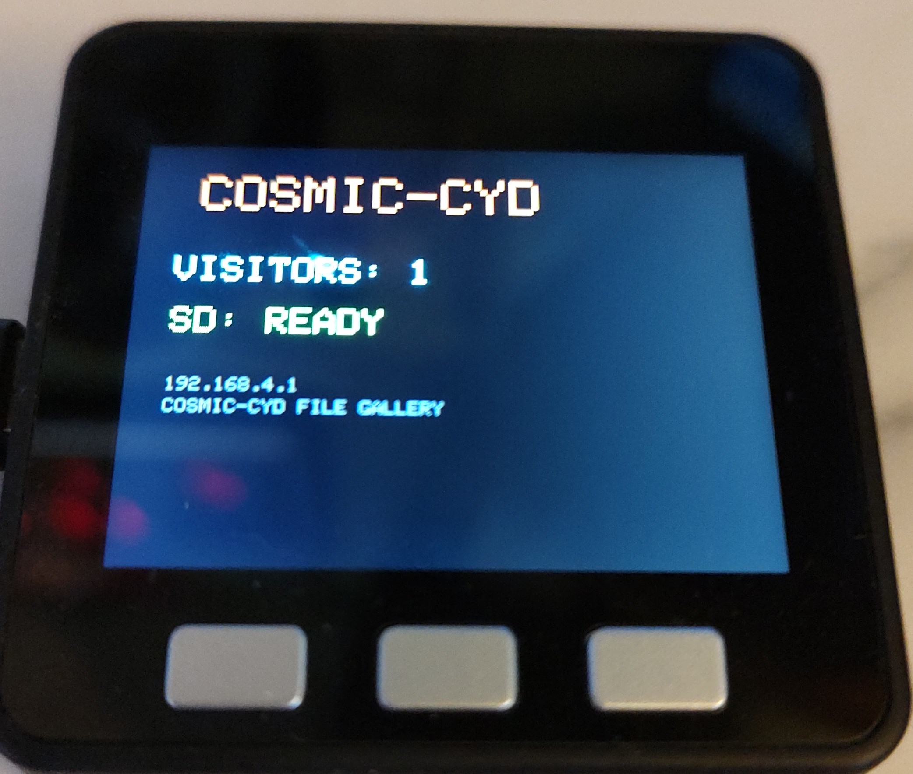
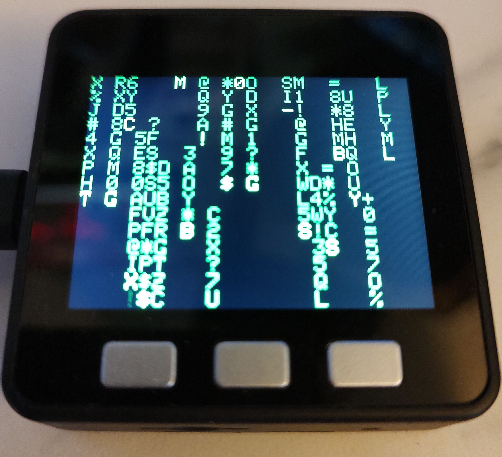

# COSMIC-CORE — M5Stack Core 1 Art Portal

A full-featured **WiFi captive portal** for the **M5Stack Core 1 (Basic)**. Power it on, connect your phone to the WiFi hotspot, and you're dropped into an interactive art gallery, cosmic trivia game, visitor guestbook, and SD file gallery — all running on a tiny ESP32 with three physical buttons.

---

## Photos

| Idle Portal Screen | Matrix Rain Screensaver |
|---|---|
|  |  |

---

## Features

### 🎨 Art Portal
- **70+ generative art animations** served as interactive web pages — Matrix Rain, Starfield, Plasma, Mandala, Fractal, Voronoi, Lorenz attractor, Mandelbrot, Game of Life, Snake, Tetris, Breakout, and many more
- Pure HTML5 Canvas — no app install, works in any phone browser
- **Captive portal** — connecting to the WiFi AP automatically opens the portal

### 🌌 Cosmic Trivia
- **100 cosmic & metaphysical questions** — quantum physics, black holes, consciousness, cosmology, science quotes
- Fully stateless — multiple visitors can play simultaneously
- Score rating from *Cosmic Infant* to *Cosmic Oracle*

### 📜 Visitor Guestbook
- Visitors leave a name and message (up to 100 characters)
- Entries saved permanently to SD card (`/guestbook.txt`)
- Last 10 entries shown in the portal
- Display flashes **NEW ENTRY!** + name + message for 10 seconds when someone signs

### 🗂️ SD File Gallery
- Browse and download files from the SD card over the portal
- Optional password protection (`/sdpass.txt` on SD)
- Single-visitor lock — the first connected device gets exclusive gallery access
- Bulk ZIP download

### 🌠 Screensavers (when no visitors connected)
- **Matrix Rain** — green falling characters
- **Starfield** — 3D warp star tunnel
- **Plasma Waves** — sinusoidal color field
- **Single Image** — display a custom JPEG from SD (`/ssaver.jpg`)
- **SD Image Shuffle** — cycle through all JPEGs on the SD card on a timer (1 / 5 / 15 / 30 min)
- Mode and interval saved to NVS flash — survives reboots

### 💬 Operator Preset Messages
- When a visitor is connected, press **BtnB** to open the message menu
- 5 preset messages displayed in the portal (`/api/msg`)
- **BtnA** scrolls up, **BtnB** sends, **BtnC** cancels

---

## Hardware

| Component | Details |
|---|---|
| Board | M5Stack Core 1 (Basic / Gray) |
| Display | ILI9341 TFT 320×240, built-in |
| Buttons | BtnA (left), BtnB (middle), BtnC (right) |
| SD Card | Built-in slot (CS GPIO4) |
| WiFi | ESP32 built-in 2.4 GHz |

---

## Flashing

### Option 1 — M5Burner (easiest)

1. Open **M5Burner**, click **Load** and select `CosmicCore-v1.0-MERGED.bin`
2. Set flash offset to **0x0**
3. Select your M5Stack COM port and click **Burn**

### Option 2 — PlatformIO

```
pio run --target upload
```

---

## Usage

1. Power on the M5Stack
2. On your phone or PC, connect to WiFi:
   ```
   COSMIC-CORE FILE GALLERY 🎨
   ```
3. A browser page opens automatically (captive portal). If not, navigate to:
   ```
   192.168.4.1
   ```
4. Explore the portal — art, trivia, guestbook, and gallery are all linked from the home page

---

## Button Reference

| Button | Context | Action |
|---|---|---|
| **BtnB** (middle) | Visitor connected, idle screen | Open preset message menu |
| **BtnA** (left) | Message menu open | Scroll up through presets |
| **BtnB** (middle) | Message menu open | Send selected preset |
| **BtnC** (right) | Message menu open | Cancel / close menu |

---

## SD Card Setup (optional)

Place files on the SD card to unlock extra features:

| File | Purpose |
|---|---|
| `/sdpass.txt` | Gallery password (plain text, one line) |
| `/ssaver.jpg` | Custom screensaver image |
| Any `.jpg` files | Available in SD shuffle screensaver mode + gallery |
| `/guestbook.txt` | Auto-created on first guestbook sign |

---

## Visitor Count & Persistence

- Total visitor count saved to NVS flash — persists across all reboots
- Screensaver mode and SD shuffle interval also persisted to NVS
- Gallery password loaded from SD card on boot

---

## Project Structure

```
CosmicCore/
├── platformio.ini
├── CosmicCore-v1.0-MERGED.bin    — Ready-to-flash merged binary (M5Burner)
├── CosmicCore-v1.0-MERGED.json   — M5Burner metadata
├── IMG_20260302_112354.jpg        — Idle portal screen photo
├── IMG_20260302_121451.jpg        — Matrix rain screensaver photo
└── src/
    └── main.cpp                   — Full source (~6900 lines)
```

---

## Dependencies

Managed automatically by PlatformIO:

| Library | Purpose |
|---|---|
| [M5Stack](https://github.com/m5stack/M5Stack) @ ^0.4.6 | Display (TFT_eSPI), buttons, SD, hardware init |
| [JPEGDEC](https://github.com/bitbank2/JPEGDEC) | JPEG decode for screensaver images |

---

## Memory Usage

| Resource | Used | Available |
|---|---|---|
| Flash | 38.5% (1.18 MB) | 61.5% (~1.9 MB) |
| RAM | 20.3% (66 KB) | 79.7% (~261 KB) |

Partition: `huge_app.csv` (3 MB app partition)

---

## Based On

Ported from **[CosmicCYD](../CosmicCYD)** — the same full portal originally built for the ESP32 CYD (Cheap Yellow Display / ESP32-2432S028R). All web content, screensavers, trivia, guestbook, and gallery logic are identical. Hardware layer swapped: Arduino_GFX + XPT2046 touch → M5Stack library + physical buttons.
